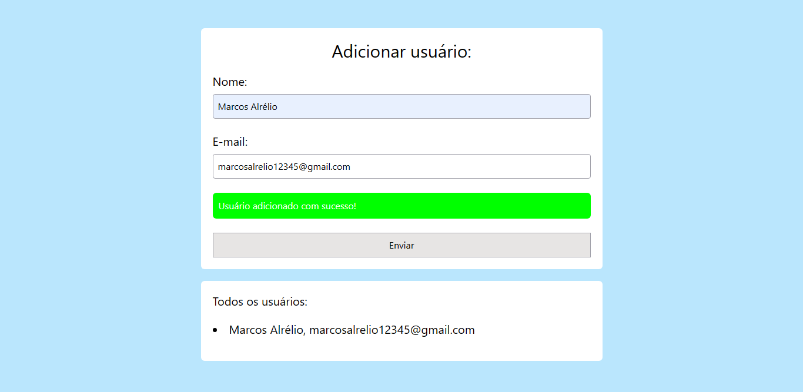

<h1 align="center"> Validando um formulário </h1>

Uma validação de formulário muito simples com JavaScript.

  <a href="#-tecnologias">Tecnologias</a>&nbsp;&nbsp;&nbsp;|&nbsp;&nbsp;&nbsp;
  <a href="#-projeto">Projeto</a>&nbsp;&nbsp;&nbsp;|&nbsp;&nbsp;&nbsp;
  <a href="#memo-licença">Licença</a>&nbsp;&nbsp;&nbsp;|&nbsp;&nbsp;&nbsp;
  <a href="#-contato">Contato</a>

  

 

  

## 🚀 Tecnologias

Esse projeto foi desenvolvido com as seguintes tecnologias:

- HTML
- Tailwind CSS
- JavaScript DOM
- GIT & GitHub

## 💻 Projeto

Este é um simples validador de formulário com HTML, Tailwind CSS e JavaScript DOM.

Dê uma olhada no projeto clicando nesse [link](https://matheusfdosan.github.io/validando-um-formulario/).

## :memo: Licença

Esse projeto está sob a licença MIT.

## 📞 Contatos

- Acesse também meus outros repositórios no [Github](https://github.com/matheusfdosan)
- Também me siga no [Instagram](https://instagram.com/matheusfdosan)